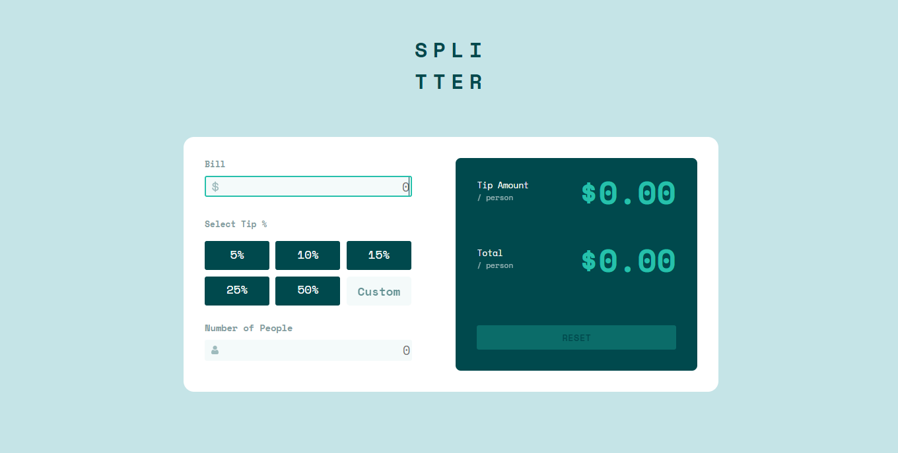

# Frontend Mentor - Tip calculator app solution

This is a solution to the [Tip calculator app challenge on Frontend Mentor](https://www.frontendmentor.io/challenges/tip-calculator-app-ugJNGbJUX). Frontend Mentor challenges help you improve your coding skills by building realistic projects.

## Table of contents

- [Overview](#overview)
  - [The challenge](#the-challenge)
  - [Screenshot](#screenshot)
  - [Links](#links)
- [My process](#my-process)
  - [Built with](#built-with)
  - [What I learned](#what-i-learned)
  - [Continued development](#continued-development)
  - [Useful resources](#useful-resources)
- [Author](#author)
- [Acknowledgments](#acknowledgments)

## Overview

### The challenge

Users should be able to:

- View the optimal layout for the app depending on their device's screen size
- See hover states for all interactive elements on the page
- Calculate the correct tip and total cost of the bill per person

### Screenshot

### Links

- Solution URL: https://tip-calculator-alpha-flax.vercel.app/

## My process

- I built the skeleton structure using HTML 
- The tip calculator was styled using CSS.
- The tip calculator main functionality was bulit using Javascript ES6 classes
- I created a tip calculator class with five properties; bill, custom, population, tipPerson, totalPerson
- In this class they are methods defined to carry out certain oprations when triggered
- The methods are below:

- getpercent() - this gets a percentage clicked
- getCustom() - this gets the value input in the custom bar
- totalbill() - this carries out the entire calculation of the tip calculator
- computTotal() - this carries out the calculation between the bill and number of persons input
- reset() - this clears the entire tip calculator

- I created a tip calculator object with the properties

- The DOM of all buttons to be used was gotten.
- Event listener was passed out to each button depending on the function it is carrying out.

### Built with

- Semantic HTML5 markup
- CSS custom properties
- Flexbox
- CSS Grid
- Javascript

### What I learned
- I was able to utilize and learn some intricacies of the Javascript ES6 class.

## Author

- Kuyooro Praise 
- Twitter - https://twitter.com/OlaKuyooro